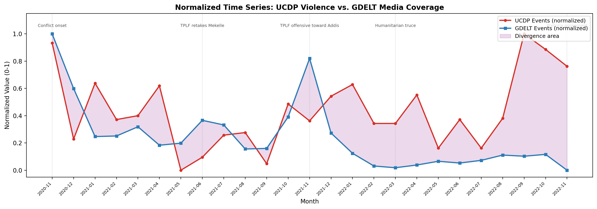
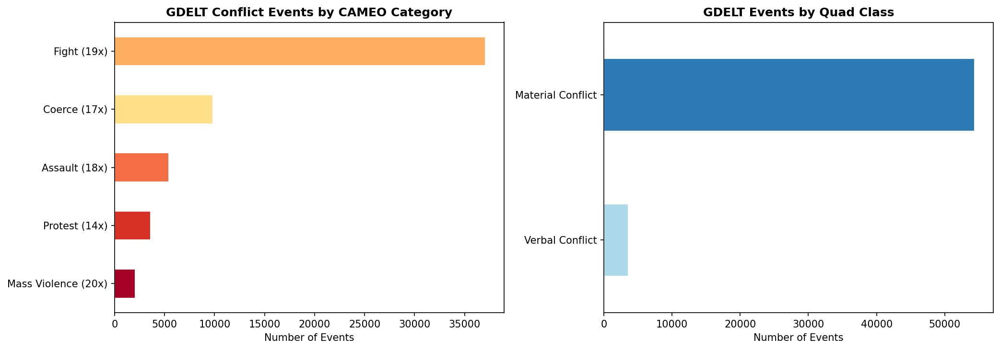
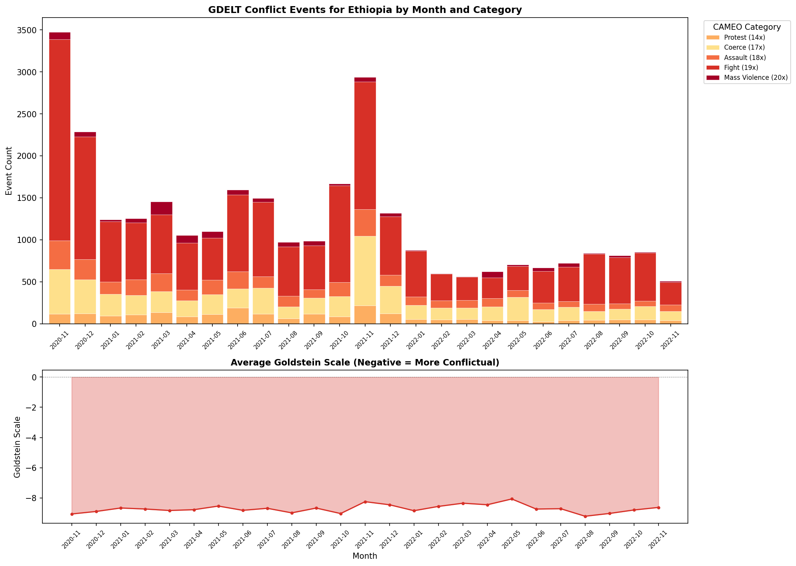
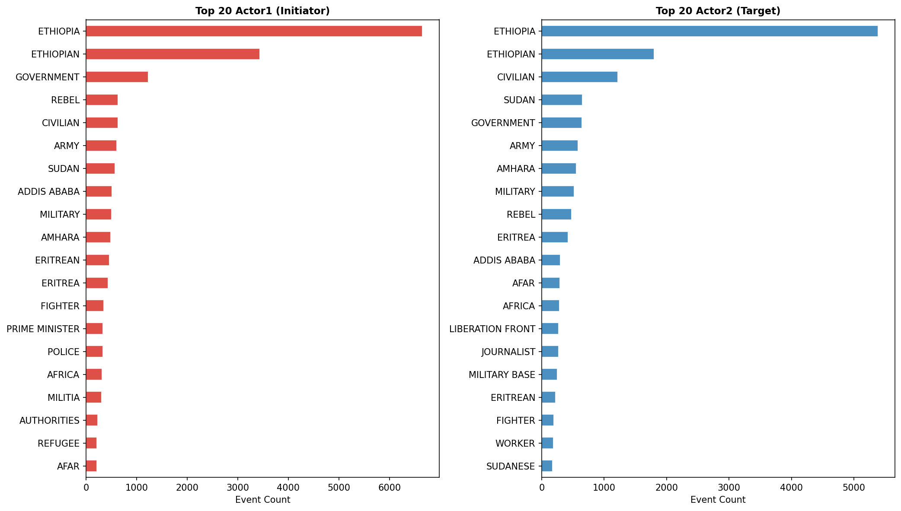
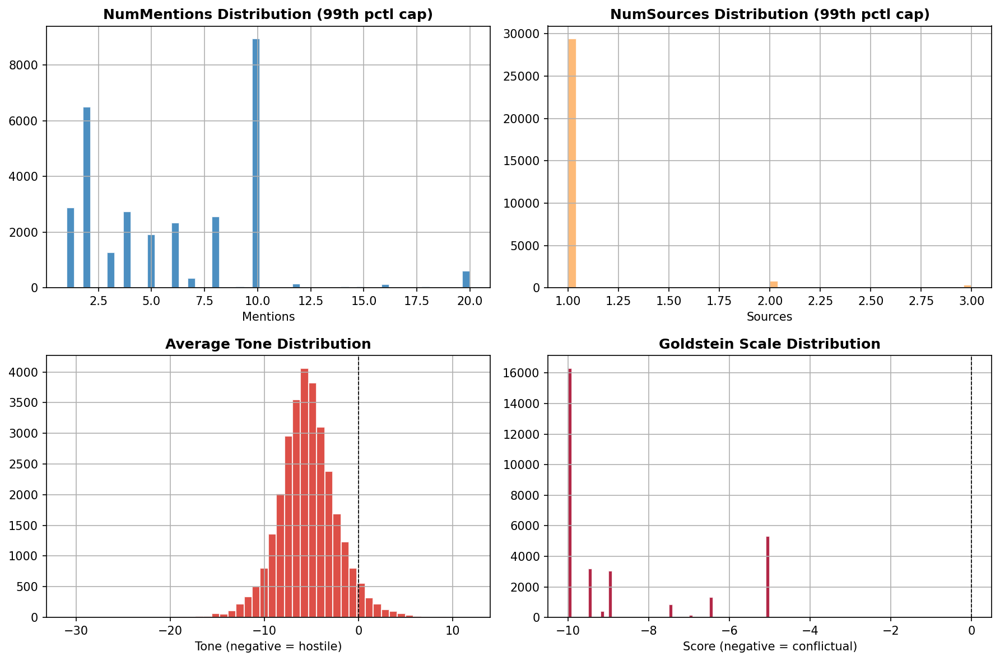
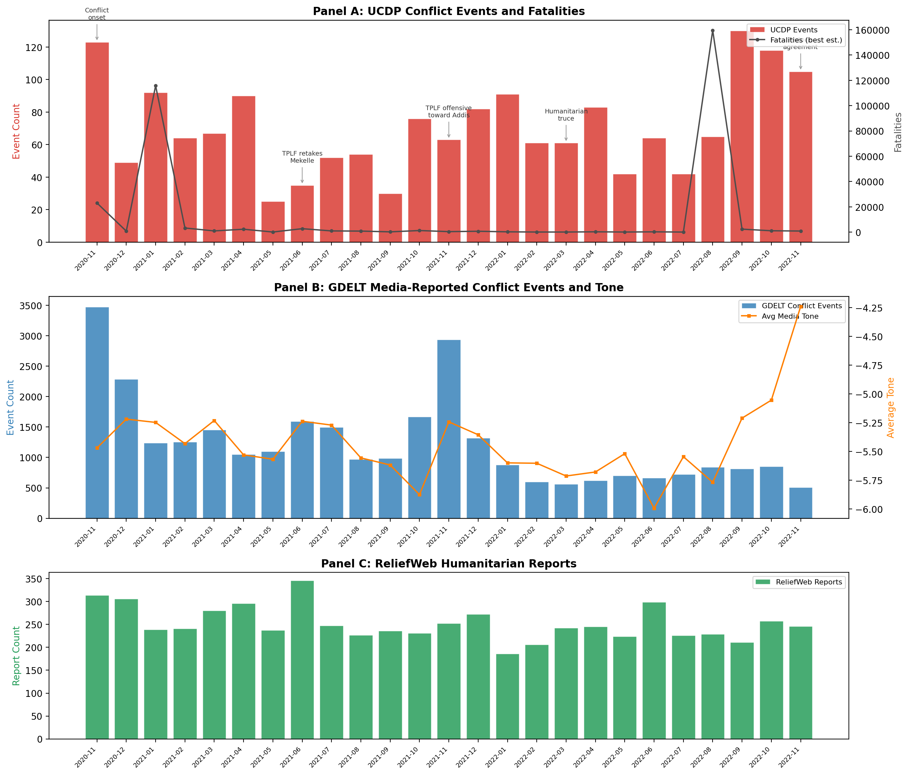
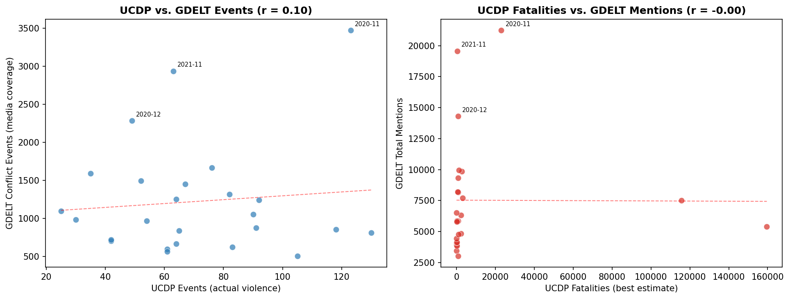
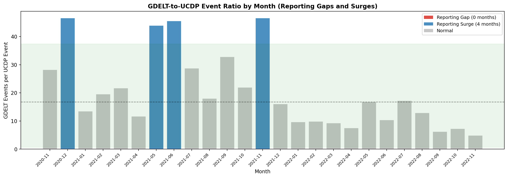

# Digital Trace Data Collection for Conflict Research

## Research Questions

**How does GDELT media attention to the Tigray conflict correlate with actual violence patterns recorded in UCDP event data, and where do reporting gaps and surges occur?**

## Navigation

| Section | Description |
|---------|-------------|
| [Motivation](#motivation) | Why data collection matters for CSS portfolios |
| [Key Findings](#key-findings) | Main results from the integration analysis |
| [Data](#data-sources) | Four data sources across three collection methods |
| [Methods](#methods) | API pipelines, BigQuery SQL, web scraping, correlation analysis |
| [Results in Detail](#results-in-detail) | Figures and interpretation for each analytical step |
| [Ethical Practices](#ethical-practices) | Responsible data collection principles |
| [Notebooks](#notebooks) | Four-notebook progression |
| [How to Reproduce](#how-to-reproduce) | Setup and replication instructions |
| [References](#key-references) | Academic sources |

## Motivation

Projects [1](https://github.com/Sezibra/conflict-event-analysis) through [7](https://github.com/Sezibra/conflict-abm-simulation) in this portfolio all started from existing, pre-compiled datasets: UCDP GED, UN documents, ACLED, Google Earth Engine imagery. None demonstrated the ability to collect raw data from digital sources. Data collection is a foundational CSS skill. Salganik's "Bit by Bit" (2017) dedicates its second chapter to observing behavior through digital traces. Jungherr's Introduction to CSS syllabus covers digital traces before methods like text analysis or network analysis. The reason is simple: if you cannot collect your own data, you are limited to datasets other people built.

This project teaches three complementary collection methods (REST APIs, BigQuery SQL queries, web scraping) and then uses the collected data to answer a substantive research question about reporting bias in conflict datasets. The UCDP and ACLED datasets that dominate the field are themselves built from systematic media monitoring. By collecting humanitarian reports and media coverage independently, I measure the information environment that feeds the conflict data ecosystem.

## Key Findings

**Media attention does not track violence intensity.** UCDP conflict events and GDELT media-reported events are essentially uncorrelated (r = 0.10, p = 0.64). International media coverage follows news cycle dynamics, not battlefield dynamics.

**Four reporting surges identified.** Months where media coverage was disproportionately high relative to recorded violence:

| Month | What happened | GDELT/UCDP ratio |
|-------|--------------|-------------------|
| Nov 2021 | TPLF offensive toward Addis Ababa, state of emergency | 46.1 |
| Dec 2020 | Conflict onset flooded international media despite blackout | 46.0 |
| Jun 2021 | TPLF retakes Mekelle, humanitarian ceasefire declared | 45.2 |
| May 2021 | Famine reports emerge from Tigray | 43.6 |

**Violence peaked when media attention was lowest.** From August to November 2022, UCDP recorded the highest violence levels of the entire study period (the resumed Ethiopian-Eritrean offensive), while GDELT media coverage remained near its lowest. The world had stopped paying attention as violence intensified.

**GDELT data requires aggressive deduplication.** Raw collection yielded 57,971 events. After removing URL/code/date duplicates, 30,601 remained (47% duplication rate). Fight events (CAMEO 19x) dominate at 60% of all conflict-coded events.



## Data Sources

| Dataset | Collection Method | Records | Role |
|---------|------------------|---------|------|
| UCDP GED v25.1 | Reference dataset ([Project 1](https://github.com/Sezibra/conflict-event-analysis)) | 1,764 events | Ground truth: actual violence in Ethiopia |
| GDELT v2 | Google BigQuery SQL | 30,601 events (after dedup) | Media-reported conflict events |
| ReliefWeb | REST API pipeline | Pending (appname approval) | UN/NGO humanitarian reports |
| ReliefWeb | Web scraping (BeautifulSoup) | 20 listings | Demonstration of scraping skill |

**Case study:** Ethiopia/Tigray conflict, November 2020 to November 2022. This case maintains portfolio coherence with Projects [1](https://github.com/Sezibra/conflict-event-analysis), [2](https://github.com/Sezibra/conflict-text-analysis), and [6](https://github.com/Sezibra/conflict-satellite-damage), and is analytically suitable because the Ethiopian government imposed a communications blackout on Tigray, creating measurable reporting gaps.

## Methods

- **REST API Pipeline (ReliefWeb)**: POST requests with JSON payloads, pagination, exponential backoff retry logic, response parsing into DataFrames. Pipeline built and tested, pending API appname approval.
- **Google BigQuery (GDELT)**: SQL queries on the `gdelt-bq.gdeltv2.events` public dataset, filtering by FIPS country code and CAMEO conflict event codes (14x, 17x, 18x, 19x, 20x). Service account authentication via JSON key.
- **Web Scraping (ReliefWeb)**: HTTP requests with BeautifulSoup HTML parsing, adaptive element detection, pagination handling, polite scraping practices (2s delays, descriptive User-Agent, robots.txt compliance).
- **Integration Analysis**: Monthly time axis alignment, Pearson and Spearman correlation, GDELT-to-UCDP ratio analysis for gap/surge detection, min-max normalized comparison.

## Results in Detail

### GDELT Collection: Event Type Distribution

Fight events (CAMEO 19x) account for roughly 60% of all conflict-coded events, followed by Coerce (17x) and Assault (18x). Nearly all events fall in the Material Conflict quadrant.



### GDELT Collection: Temporal Patterns

Two clear spikes: November 2020 (conflict onset, ~3,400 events) and November 2021 (TPLF offensive toward Addis Ababa, ~2,900 events). After early 2022, event counts drop to 500-800 per month. The Goldstein Scale stays flat around -8.5 throughout, as expected for conflict-filtered events.



### GDELT Collection: Actor Analysis

"ETHIOPIA" and "ETHIOPIAN" appear as separate actors due to GDELT's automated name extraction, together accounting for ~10,000 events as Actor1. CIVILIAN ranks third among Actor2 entries, consistent with the one-sided violence patterns from Project [1](https://github.com/Sezibra/conflict-event-analysis).



### GDELT Collection: Media Metrics

Most events come from a single source (NumSources concentrated at 1). Average tone is negative across the board, centered around -5 to -7. The Goldstein Scale distribution clusters at -10 and -9, reflecting the most conflictual CAMEO codes.



### Integration: Multi-Panel Time Series

Panel A shows UCDP events and fatalities. Panel B shows GDELT media events and average tone. The two panels reveal distinct dynamics: violence followed military logic (high at onset, lower during the blackout, resurgent in late 2022), while media attention followed news cycle logic (high at onset, high during diplomatic crises, declining over time regardless of violence).



### Integration: Correlation Analysis

UCDP events vs. GDELT events: r = 0.10, p = 0.64 (not significant). UCDP fatalities vs. GDELT mentions: r = -0.00, p = 0.98 (not significant). The scatter plots show no linear relationship. November 2020, November 2021, and December 2020 are outliers driven by sudden international attention spikes.



### Integration: Reporting Gaps and Surges

The GDELT-to-UCDP ratio identifies months where media coverage was disproportionately high (blue) or low (red) relative to violence levels. Four surge months stand out above the normal range. No formal reporting gaps were detected, though the late-2022 period shows the ratio dropping steadily as violence rises.



### Integration: Normalized Comparison

Both series are scaled to 0-1 to compare temporal patterns directly. The purple divergence area highlights where the two sources disagree. The lines converge at conflict onset (Nov 2020) and the TPLF offensive (Nov 2021), but diverge sharply in late 2022 when UCDP violence spikes while GDELT attention fades.


### GDELT Data Quality Assessment

| Quality Issue | Count | Percentage |
|--------------|-------|------------|
| Raw events collected | 57,971 | 100% |
| URL/code/date duplicates removed | 27,370 | 47.2% |
| Events after deduplication | 30,601 | 52.8% |
| Low-confidence (single mention) | 2,890 | 9.4% |
| Missing geolocation | 0 | 0.0% |
| Missing Actor1 name | 2,410 | 7.9% |
| Missing Actor2 name | 8,933 | 29.2% |

## Ethical Practices

This project follows responsible data collection principles:

- **Rate limiting**: Minimum 2-second delays between all HTTP requests
- **Server identification**: Descriptive User-Agent header on all requests
- **robots.txt compliance**: Checked before scraping
- **Terms of service**: ReliefWeb API is explicitly open for research. GDELT is public data on BigQuery.
- **Credential security**: Google Cloud service account keys stored in `credentials/` and excluded from git via `.gitignore`
- **Data privacy**: All collected data is from public sources (UN reports, news media). No private personal data collected.
- **Reproducibility**: Collection parameters (date ranges, filters, query strings) are documented in code and this README

## Project Structure

```
conflict-data-collection/
├── README.md
├── requirements.txt
├── .gitignore
├── collectors/
│   ├── reliefweb_collector.py      # ReliefWeb API functions
│   ├── gdelt_collector.py          # BigQuery query functions
│   └── scraper.py                  # Web scraping functions
├── notebooks/
│   ├── 01_reliefweb_api_collection.ipynb
│   ├── 02_gdelt_bigquery_collection.ipynb
│   ├── 03_web_scraping.ipynb
│   └── 04_integration_analysis.ipynb
├── credentials/                    # Service account keys (not tracked)
├── data/
│   ├── raw/                        # Data as originally collected (not tracked)
│   ├── processed/                  # Cleaned, analysis-ready datasets (not tracked)
│   └── README.md                   # Data dictionary
└── figures/                        # Saved plots
```

## Notebooks

| Notebook | Description | Key Output |
|----------|-------------|------------|
| 01 ReliefWeb API | Build REST API pipeline with pagination, retry logic, JSON parsing | Pipeline complete, pending appname approval |
| 02 GDELT BigQuery | Query GDELT v2 via SQL, filter CAMEO codes, assess data quality | 30,601 events, 47% dedup rate |
| 03 Web Scraping | Scrape ReliefWeb with BeautifulSoup, handle pagination, polite practices | 20 listings, robots.txt compliant |
| 04 Integration | Merge UCDP + GDELT on monthly axis, correlation, gap/surge analysis | r = 0.10, 4 reporting surges |

## How to Reproduce

1. Download UCDP GED v25.1 from https://ucdp.uu.se/downloads/ and place in `data/raw/`
2. Set up a Google Cloud project with BigQuery API enabled and a service account key in `credentials/bigquery-key.json`
3. Register a ReliefWeb API appname at https://docs.google.com/forms/d/e/1FAIpQLScR5EE_SBhweLLg_2xMCnXNbT6md4zxqIB00OL0yZWyrqX_Nw/viewform
4. Install dependencies: `pip install -r requirements.txt`
5. Run notebooks in order: 01, 02, 03, 04

Notebook 02 requires Google Cloud authentication and uses the BigQuery free tier (1 TB/month). Notebook 01 requires an approved ReliefWeb appname.

## Key References

- Salganik, M. J. (2017). *Bit by Bit: Social Research in the Digital Age*. Princeton University Press.
- Weidmann, N. B. (2016). A Closer Look at Reporting Bias in Conflict Event Data. *American Journal of Political Science*, 60(1), 206-218.
- Leetaru, K. and Schrodt, P. A. (2013). GDELT: Global Data on Events, Location, and Tone. *ISA Annual Convention*.
- Munzert, S. et al. (2015). *Automated Data Collection with R*. Wiley.
- Mitchell, R. (2018). *Web Scraping with Python*. O'Reilly Media.
- Lazer, D. et al. (2009). Computational Social Science. *Science*, 323(5915), 721-723.
- ReliefWeb API Documentation: https://apidoc.reliefweb.int/
- GDELT Project Documentation: https://www.gdeltproject.org/

## Skills Demonstrated

REST API integration (request construction, JSON parsing, pagination, error handling with retry logic), Google BigQuery SQL queries on public datasets, web scraping with requests and BeautifulSoup (HTML parsing, element detection, pagination), data pipeline design (collection, cleaning, raw vs. processed storage, documentation), data quality assessment (duplicate detection, coverage measurement, noise quantification), multi-source data integration on a common time axis, correlation analysis and reporting bias detection, ethical data collection practices (rate limiting, robots.txt, terms of service compliance), Google Cloud authentication and service account management.

## Portfolio Context

| Project | Topic | Status |
|---------|-------|--------|
| 1 | [Conflict Event Data Analysis and Geospatial Visualization](https://github.com/Sezibra/conflict-event-analysis) | Complete |
| 2 | [LLM-Powered Conflict Text Analysis](https://github.com/Sezibra/conflict-text-analysis) | Complete |
| 3 | [Conflict Actor Network Analysis](https://github.com/Sezibra/conflict-network-analysis) | Complete |
| 4 | [Conflict Forecasting with Machine Learning](https://github.com/Sezibra/conflict-forecasting-ml) | Complete |
| 5 | [Causal Inference for Conflict with ML](https://github.com/Sezibra/conflict-causal-inference) | Complete |
| 6 | [Satellite Imagery for Conflict Damage Assessment](https://github.com/Sezibra/conflict-satellite-damage) | Complete |
| 7 | [Agent-Based Modeling for Conflict Dynamics](https://github.com/Sezibra/conflict-abm-simulation) | Complete |
| 8 | **Digital Trace Data Collection** (this repo) | **Complete** |
